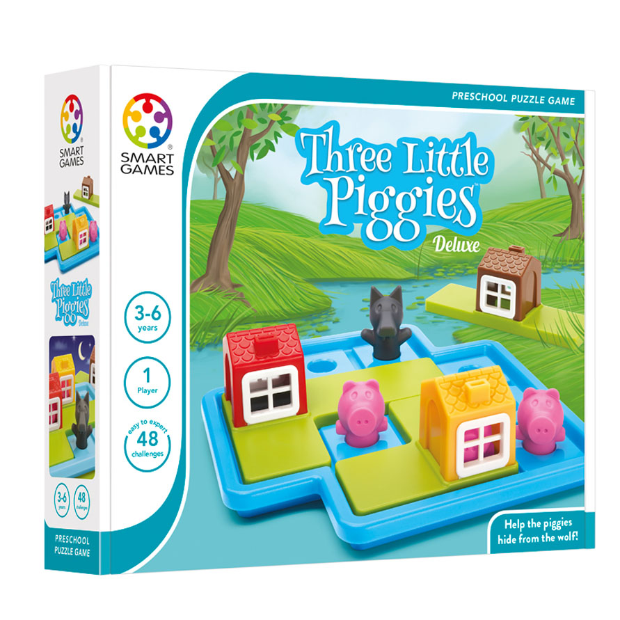

# Three Little Piggies

A front-end project for a webpage version of the preschool board game by [Smart Games](https://www.smartgames.com/uk/one-player-games/three-little-piggies-deluxe).

This is the first board game my child was able to grasp the rules of and play at the age of three. We had a lot of fun with this game, so when I want to practice my front-end skills, it comes to mind.

### Tech Stack

- Typescript
- CSS
- HTML5
- Webpack

- Object Oriented Programming
